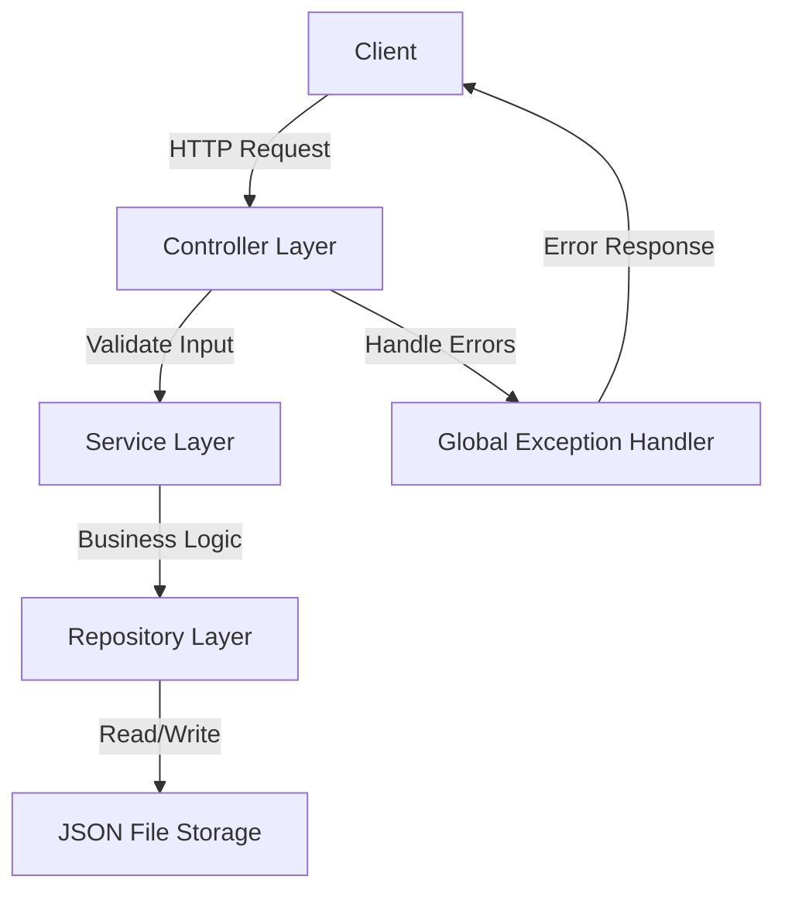

# Customer Management API

<div align="center">


**A production-ready Spring Boot REST API for customer management with comprehensive testing and Docker support**

[Get Started](getting-started/installation.md){ .md-button .md-button--primary }
[API Reference](api-reference/overview.md){ .md-button }
[GitHub](https://github.com/alokkulkarni/copilotSkills){ .md-button }

</div>

---

## Overview

The Customer Management API is a modern, production-ready Spring Boot application that provides a complete REST API for managing customer data. Built with best practices, comprehensive testing, and containerization support, it's designed to serve as both a functional application and a reference implementation.

## Key Features

<div class="grid cards" markdown>

-   :material-api: **RESTful API**

    ---

    Complete CRUD operations with validation, pagination, and consistent error handling.

-   :material-shield-check: **Input Validation**

    ---

    Jakarta Bean Validation with detailed error messages and field-level feedback.

-   :material-file-document: **Comprehensive Testing**

    ---

    61 unit and integration tests with 98% coverage including concurrent access tests.

-   :material-docker: **Docker Ready**

    ---

    Multi-stage Dockerfile with health checks, non-root user, and optimized JVM settings.

-   :material-speedometer: **Pagination Support**

    ---

    Efficient pagination with metadata (page, size, totalElements, totalPages).

-   :material-lock: **Thread-Safe**

    ---

    Synchronized repository operations for safe concurrent access.

</div>

## Technology Stack

| Technology | Version | Purpose |
|------------|---------|---------|
| **Java** | 17 | LTS runtime |
| **Spring Boot** | 3.2.2 | Application framework |
| **Maven** | 3.6+ | Build tool |
| **JUnit 5** | - | Testing framework |
| **Mockito** | - | Mocking framework |
| **AssertJ** | - | Fluent assertions |
| **Swagger/OpenAPI** | 3.0 | API documentation |
| **Docker** | - | Containerization |

## Architecture



## Quick Example

### Create a Customer

=== "cURL"

    ```bash
    curl -X POST http://localhost:8080/api/customers \
      -H "Content-Type: application/json" \
      -d '{
        "name": "John Doe",
        "email": "john@example.com"
      }'
    ```

=== "Response"

    ```json
    {
      "id": "550e8400-e29b-41d4-a716-446655440000",
      "name": "John Doe",
      "email": "john@example.com"
    }
    ```

### Get All Customers (Paginated)

=== "cURL"

    ```bash
    curl "http://localhost:8080/api/customers?page=0&size=10"
    ```

=== "Response"

    ```json
    {
      "content": [
        {
          "id": "550e8400-e29b-41d4-a716-446655440000",
          "name": "John Doe",
          "email": "john@example.com"
        }
      ],
      "page": 0,
      "size": 10,
      "totalElements": 1,
      "totalPages": 1
    }
    ```

## Project Statistics

| Metric | Value |
|--------|-------|
| **Total Tests** | 61 |
| **Test Coverage** | 98% |
| **Controller Tests** | 17 |
| **Service Tests** | 14 |
| **Repository Tests** | 17 |
| **Model Tests** | 13 |
| **Lines of Code** | ~2,000 |

## Next Steps

<div class="grid" markdown>

!!! tip "New to the project?"
    Start with the [Installation Guide](getting-started/installation.md) to set up your development environment.

!!! info "Ready to develop?"
    Check out the [Quick Start](getting-started/quick-start.md) to run your first API calls.

!!! example "Want to contribute?"
    Read the [Contributing Guide](development/contributing.md) to learn about our development process.

</div>

## Support & Community

- :material-github: **GitHub**: [Report issues](https://github.com/alokkulkarni/copilotSkills/issues)
- :material-shield-alert: **Security**: See [Security Policy](reference/security.md)
- :material-file-document: **License**: [MIT License](reference/license.md)

---

<div align="center">
  <sub>Built with :heart: by Alok Kulkarni</sub>
</div>
